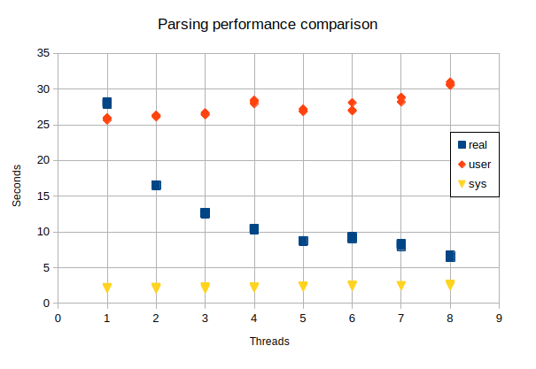

# aparser

## Задание
Написать программу, в заданное число потоков разбирающую логи веб-сервера в стандартном (“com-
bined”) формате и подсчитывающую агрегированную статистику: общее количество отданных байт, 10
самых “тяжёлых” по суммарному трафику URL’ов и 10 наиболее часто встречающихся Referer’ов.

## Задачи:
1. Создать консольное приложение, принимающее аргументами командной строки директорию с
логами и количество потоков.
2. Реализовать парсинг файла логов и подсчёт статистики.
3. Собрать и вывести суммарную статистику пофайлам.

## Требования к коду:
* приложение корректно подсчитывает требуемые статистические данные (файлы логов для проверки
прилагаются);
* приложение корректно обрабатывает случай пустой директории с логами;
* приложение корректно обрабатывает ошибки доступа к файлам;
* успешная компиляция с флагами `-Wall -Wextra -Wpedantic -std=c11`.

## Вспомогательные материалы
1. [Описание “combined” формата логов](http://httpd.apache.org/docs/2.4/logs.html#combined)

# Реализация

Требования: компилятор Си11, стандартная библиотека (проверялось в Linux, GCC 13.2.0, libc 2.38).

Сборка: `make` или `gcc -o aparser.c crc32.c -Wall -Wextra -Wpedantic -std=c11.`

Использование: `./aparser log_dir num_threads`.

## Результаты выполнения

Проверялось на AMD Ryzen 5 3600 (6 cores).

